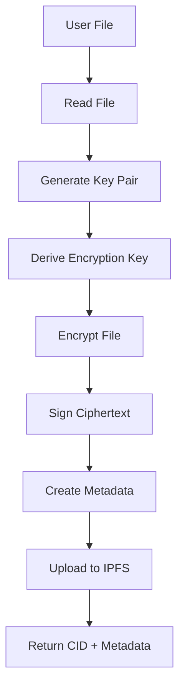
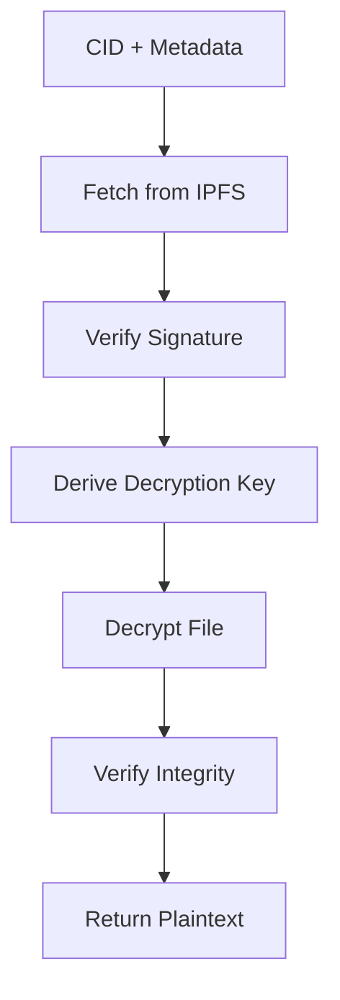

# Architecture

This document describes the architecture and design of IPFS Encrypted Storage.

## System Overview

IPFS Encrypted Storage is a decentralized, end-to-end encrypted file storage system built on top of IPFS (InterPlanetary File System). The system provides secure file storage with cryptographic guarantees while leveraging the decentralized nature of IPFS for data persistence and availability.

**Version:** 1.0.0+ (Post-Refactoring)
**Last Updated:** December 2025

```
┌─────────────────┐    ┌─────────────────┐    ┌─────────────────┐    ┌─────────────────┐
│   CLI Commands  │    │   REST API      │    │   IPFS Network  │    │ P2P Local Stub  │
│   (cmd/)        │    │   (api/)        │    │                 │    │                 │
│ • Upload        │◄──►│ • REST Endpoints│◄──►│ • Content       │    │ • Local Storage │
│ • Download      │    │ • Authentication│    │   Addressing    │    │ • Local PubSub  │
│ • List/Delete   │    │ • JSON API      │    │ • File Storage  │    │ • Addr Validation│
│ • P2P/Verify    │    └─────────────────┘    └─────────────────┘    └─────────────────┘
└─────────────────┘             ▲                       ▲                       ▲
         ▲                      │                       │                       │
         │             ┌─────────────────┐    ┌─────────────────┐    ┌─────────────────┐
         └────────────►│  Error Handling │    │  Proof Demo     │    │   DID System    │
                       │   (errors/)     │    │                 │    │                 │
                       │ • EnhancedError │    │ • Schnorr Proofs│    │ • Identity Mgmt │
                       │ • Suggestions   │    │ • Test Context  │    │ • Credentials   │
                       │ • Context       │    └─────────────────┘    └─────────────────┘
                       └─────────────────┘
                                ▲
                                │
┌─────────────────┐    ┌─────────────────┐    ┌─────────────────┐    ┌─────────────────┐
│  Utilities      │    │  Encryption     │    │  Config        │    │  Handlers       │
│  (utils/)       │    │  (encryption/)  │    │  (config/)     │    │  (handlers/)    │
│ • JSON Utils    │◄──►│ • AES-256-GCM   │    │ • Settings     │    │ • Stub Parsers  │
│ • Validation    │    │ • Argon2 KDF    │    │ • Environment  │    │ • No Transport  │
│ • Retry Logic   │    │ • Ed25519 Sigs  │    │ • Validation   │    │ • Local Topics  │
└─────────────────┘    └─────────────────┘    └─────────────────┘    └─────────────────┘
```

The P2P stub is independent from the IPFS client. It does not open a network transport, discover peers, or implement a DHT.

## Core Components

### 1. CLI Commands (`src/cmd/`)

The modular command-line interface provides user interaction with the system:

- **Command Structure**: Separated commands in individual files
  - `root.go`: Root command and configuration
  - `upload.go`: File upload operations
  - `download.go`: File download operations
  - `list.go`: List stored files
  - `delete.go`: File deletion operations
  - `p2p.go`: Local P2P stub operations
  - `init.go`: System initialization
  - `verify.go`: File verification
  - `api.go`: API server management
- **Key Management**: Handles cryptographic key operations
- **Configuration**: Manages system settings via config package
- **Interactive Input**: Secure password collection

### 2. REST API (`src/api/`)

Provides programmatic access to system functionality:

- **Simple Server**: HTTP server with basic routing (`server_simple.go`)
- **API Endpoints**: RESTful endpoints for file operations
- **Authentication**: API key-based authentication
- **Middleware**: CORS, logging, and error handling
- **Models**: Request/response structures (`models/`)

### 3. Utilities (`src/utils/`)

Centralized utility functions for common operations:

- **JSON Utilities** (`jsonutils.go`): Safe type conversions from JSON
  - Support for base64, hex, and direct encoding
  - Comprehensive error handling
- **Validation** (`validation.go`): Input validation with enhanced errors
  - File validation (size, format, existence)
  - Password strength checking
  - CID and peer address validation
  - IPFS endpoint validation
- **Retry Logic** (`retry.go`): Exponential backoff retry mechanisms

### 4. Error Handling (`src/errors/`)

Advanced error handling system with contextual information:

- **EnhancedError**: Structured error with context and suggestions
- **Error Context**: Operation, resource, and user information
- **Recovery Suggestions**: Context-aware error recovery guidance
- **Error Classification**: Automatic error type detection

### 5. Encryption Module (`src/encryption/`)

Provides cryptographic operations for data security:

- **AES-256-GCM**: Authenticated encryption for file contents
- **Argon2 Key Derivation**: Password-based key generation
- **Ed25519 Signatures**: Data integrity and authenticity verification
- **Key Buffer Overwrite**: Best-effort overwrite of one in-memory buffer; runtime copies are outside this guarantee

## Modular Architecture Design

### Command Pattern Implementation

The system uses a modular command pattern for CLI operations:

```
src/main.go (25 lines)
├── cmd/root.go          - Root command & config
├── cmd/upload.go        - File upload command
├── cmd/download.go      - File download command
├── cmd/list.go          - List files command
├── cmd/delete.go        - Delete files command
├── cmd/p2p.go           - Local P2P stub command
├── cmd/init.go          - Initialization command
├── cmd/verify.go        - Verification command
└── cmd/api.go           - API server command
```

### Utility Layer Architecture

Centralized utilities provide consistent functionality across modules:

```
src/utils/
├── jsonutils.go         - Safe JSON type conversions
├── validation.go        - Input validation with enhanced errors
└── retry.go             - Retry logic with backoff
```

### Error Handling Architecture

Structured error handling with context and recovery suggestions:

```
src/errors/errors.go
├── EnhancedError         - Core error structure
├── ErrorContext          - Contextual information
├── ErrorHandler          - Centralized error processing
└── Error Classification  - Automatic error categorization
```

### API Architecture

REST API design with middleware and models:

```
src/api/
├── server_simple.go      - HTTP server implementation
├── models/
│   ├── requests.go       - Request structures
│   └── errors.go         - API error responses
├── handlers/            - (Future: Request handlers)
└── middleware/          - (Future: Auth, CORS, logging)
```

### 6. IPFS Client (`src/ipfs/`)

Interfaces with the IPFS network:

- **File Operations**: Upload/download files to/from IPFS
- **Directory Management**: Handle directory structures
- **Pinning**: Ensure data persistence
- **Health Monitoring**: Check IPFS node status

### 7. P2P Stub (`src/p2p/`)

Provides local in-memory behavior while network transport remains pending:

- **Identity**: Valid libp2p peer IDs
- **Addressing**: Multiaddress validation
- **Storage**: Node-local key/value storage
- **Messaging**: Same-node publish/subscribe only
- **Bootstrap**: Address validation without network dialing

### 8. P2P Message Parsers (`src/handlers/`)

Parses and logs local stub messages; it does not transfer files or route network traffic:

- **Storage Handler**: Parses storage announcements and queries
- **File Request Handler**: Parses file requests without fetching or returning content
- **Topic Handler**: Parses local PubSub messages

### 9. Configuration Management (`src/config/`)

Centralized configuration management:

- **Settings Loading**: Environment and file-based configuration
- **Validation**: Configuration parameter validation
- **Defaults**: Sensible default values
- **Environment Integration**: Environment variable support

### 5. Experimental Proof Demo (`zkp.go`)

Provides an educational Schnorr transcript, not a production authorization system:

- **Schnorr Transcript**: Demonstrates proof generation and verification
- **Access Context**: Demonstrates binding a transcript to resource metadata
- **Range Proofs**: Not implemented; generation and verification fail closed
- **Parameters**: Intentionally small and insecure outside tests

### 6. Decentralized Identity (`did.go`)

Provides identity management:

- **DID Operations**: Create and manage decentralized identifiers
- **Credential Issuance**: Issue verifiable credentials
- **Resolution**: Resolve DIDs to documents
- **Registry**: Identity document storage

### 7. Content Addressing (`content_addressable.go`)

Implements content-addressable storage patterns:

- **Hash Functions**: SHA-256 based content addressing
- **Merkle DAGs**: Directed acyclic graph construction
- **Block Management**: Content block operations
- **File System Abstraction**: CAFS interface

## Enhanced Features

### Input Validation System

Comprehensive input validation with user-friendly error messages:

- **File Validation**: Size limits, format checking, accessibility
- **Password Validation**: Strength requirements, entropy calculation, common password detection
- **CID Validation**: IPFS Content Identifier format verification
- **Peer Address Validation**: Multiaddr format validation
- **IPFS Endpoint Validation**: URL format and accessibility checking

### Advanced Error Handling

Contextual error handling with recovery suggestions:

- **EnhancedError Structure**: Structured error information with context
- **Error Context**: Operation details, affected resources, retry information
- **Recovery Suggestions**: Context-aware actionable suggestions
- **Error Classification**: Automatic categorization for appropriate handling
- **User-Friendly Messages**: Clear, actionable error communication

### Safe JSON Processing

Robust JSON type conversion utilities:

- **Multi-Format Support**: Base64, hex, direct, and array representations
- **Type Safety**: Safe conversions with comprehensive error handling
- **Format Detection**: Automatic format detection and conversion
- **Comprehensive Types**: Support for all common JSON types

## Data Flow

### File Upload Process



### File Download Process



## Security Architecture

### Encryption Layers

1. **File-level Encryption**: AES-256-GCM with unique nonces
2. **Key Derivation**: Argon2 with configurable parameters
3. **Signature Verification**: Ed25519 for integrity checks
4. **Authorization**: Not provided by the experimental ZKP demo

### Key Management

- **Private Keys**: Stored locally as base64-encoded JSON, without encryption at rest; filesystem permissions are required
- **Public Keys**: Embedded in metadata for verification
- **Passwords**: Used for encryption (never stored)
- **Key Rotation**: No automated rotation workflow is implemented

### Network Security

- **P2P Transport**: Not implemented by the current in-memory stub
- **DHT Security**: Not applicable until distributed networking is implemented
- **Private Networks**: Private-swarm provisioning is outside this repository

## Storage Architecture

### Content Addressing

Files are identified by their cryptographic hash:

```
Content → SHA-256 Hash → CID → IPFS Storage
```

### Metadata Structure

```json
{
  "cid": "Qm...",
  "filename": "document.pdf",
  "size": 1048576,
  "uploaded_at": 1638360000,
  "encrypted": true,
  "encryption_metadata": {
    "salt": "...",
    "signature": "...",
    "public_key": "...",
    "config": {
      "time": 1,
      "memory": 65536,
      "threads": 4
    }
  }
}
```

### Merkle DAG Structure

```
Root Block (Directory)
├── File Block 1
├── File Block 2
└── Subdirectory Block
    ├── Nested File 1
    └── Nested File 2
```

## Performance Characteristics

### Benchmarks

- **Encryption**: Optimized AES-256-GCM operations
- **Key Derivation**: Configurable Argon2 parameters
- **Network**: IPFS client operations only; libp2p transport is pending
- **Storage**: Minimal metadata overhead (~1KB per file)

### Scalability

- **Horizontal Scaling**: IPFS network distribution
- **Concurrent Operations**: Multi-threaded processing
- **Memory Usage**: Efficient cryptographic operations
- **Storage Efficiency**: Deduplication through content addressing

## Error Handling

### Recovery Mechanisms

- **Network Failures**: Retry logic with exponential backoff
- **Corrupted Data**: Signature verification and integrity checks
- **Key Loss**: Backup and recovery procedures
- **Storage Issues**: Replication and pinning strategies

### Logging and Monitoring

- **Structured Logging**: Consistent log format across components
- **Health Checks**: System status monitoring
- **Metrics Collection**: Performance and usage statistics
- **Debug Information**: Comprehensive error reporting

## Extension Points

### Plugin Architecture

The system is designed for extensibility:

- **Custom Encryption**: Pluggable encryption algorithms
- **Alternative Storage**: Support for different backends
- **Enhanced ZKPs**: Additional zero-knowledge proof systems
- **Identity Providers**: Multiple DID method support

### API Design

- **Modular Components**: Clean interfaces between modules
- **Configuration**: Flexible configuration system
- **Testing**: Comprehensive test coverage enables refactoring
- **Documentation**: Well-documented APIs for integration
